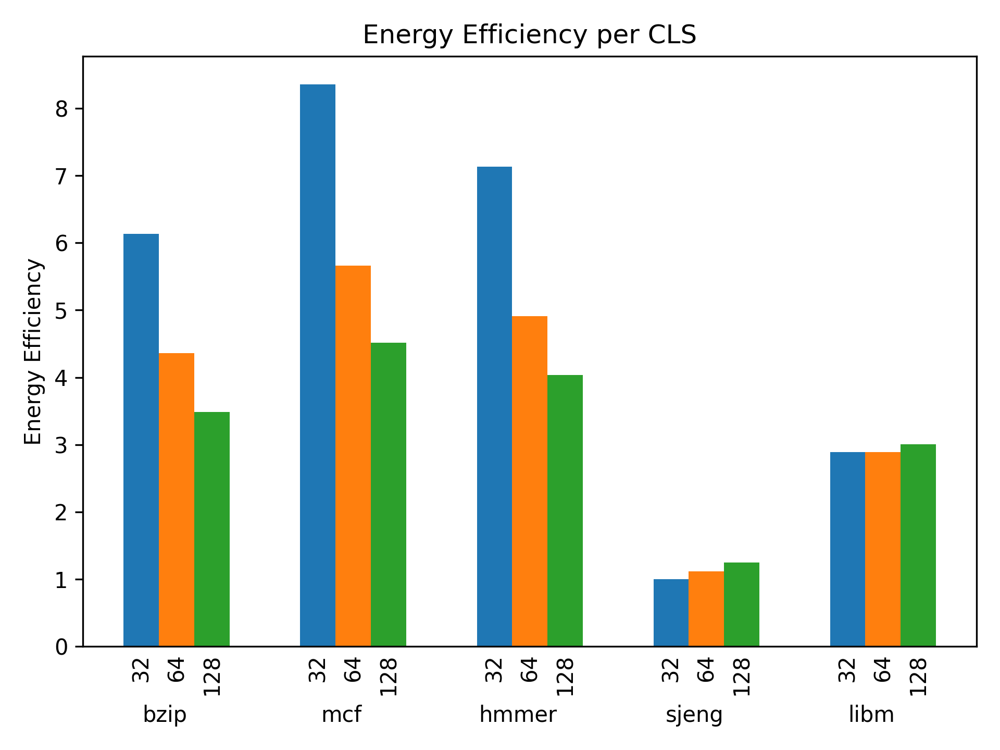

# 3η εργασία Αρχιτεκτονικής Προηγμένων Υπολογιστών
## Συντελεστές (ομάδα 9):
Κυδώνης Ιωάννης, ΑΕΜ: 9407, email: ikydonis@ece.auth.gr  
Ούρδας Αντώνιος, ΑΕΜ: 9358, email: ourdasav@ece.auth.gr

## Βήμα 1

### Ερώτημα 1

Η ισχύς που καταναλώνεται από ένα ολοκληρωμένο κύκλωμα μπορεί να είναι είτε στατική (static ή leakage) είτε δυναμική (dynamic).

Στατική ισχύς (leakage power) είναι εκείνη που καταναλώνεται από τα transistor για να βρίσκονται σε λειτουργία και οφείλεται κυρίως σε διαρροές ρεύματος υποκατωφλίου οπότε παραμένει σχετικά σταθερό<sup>[[1]](#πηγές)</sup>.

Δυναμική ισχύς (dynamic power) είναι αυτή που καταναλώνεται κατά την αλλαγή κατάστασης του transistor.
Όσο δε συμβαίνουν μεταβολές στην κατάσταση των transistors η δυναμική ισχύς που καταναλώνεται είναι μηδενική<sup>[[2]](#πηγές)</sup>.

Τρέχοντας λοιπόν ένα διαφορετικό πρόγραμμα η δυναμική ισχύς (dynamic) μπορεί να είναι διαφορετική, υψηλότερη στην περίπτωση που προκύπτουν περισσότερες εναλλαγές κατάστασης στα transistor του επεξεργαστή και χαμηλότερη αν προκύπτουν λιγότερα. Ένα πιο "βαρύ" πρόγραμμα θα οδηγήσει και σε μεγαλύτερη δυναμική ισχύ.
Αντίθετα, η στατική ισχύς (leakage) θα παραμείνει σταθερή καθώς δεν εξαρτάται από τον αριθμό των εναλλαγών κατάστασης.

Αν θεωρήσουμε ότι το εκτελούμενο πρόγραμμα επιβαρύνει με σταθερό τρόπο τον επεξεργαστή, ο χρόνος εκτέλεσης του προγράμματος δεν παίζει ρόλο καθώς η ισχύς μας δίνει το έργο στη μονάδα του χρόνου.
Αν από την άλλη το εκτελούμενο πρόγραμμα δεν έχει ομοιόμορφη συμπεριφορά στον χρόνο τότε η μέση δυναμική ισχύς που θα προκύψει θα είναι διαφορετική καθώς ο αριθμός των εναλλαγών καταστάσεων στα transistor στη μονάδα του χρόνου δε θα είναι σταθερός.

### Ερώτημα 2

Για να συγκρίνουμε 2 επεξεργαστές ως προς την κατανάλωση ενέργειας που απαιτούν, χρειάζεται να λάβουμε υπόψιν όχι μόνο της ισχύ τους αλλά και το πόσο γρήγορα εκτελούν τις επιθυμητές εντολές.
Η σύγκριση λοιπόν πρέπει να γίνει με βάση την μετρική που δίνει το πηλίκο αριθμού εντολών ανά μονάδα έργου:
```
Efficiency = Instructions / Work

ή

Efficiency = (Instructions / Time) / (Work / Time)

ή

Efficiency = (Instructions / Time) / Power

ή

Efficiency = Instructions / (Time * Power)
```

οπότε για τη συγκεκριμένη περίπτωση όπου Power<sub>1</sub> = 4 W και Power<sub>2</sub> = 40 W έχουμε:

<pre>
Efficiency<sub>1</sub> < Efficiency<sub>2</sub>

ή 

Instructions / (Time<sub>1</sub> * Power<sub>1</sub>) < Instructions / (Time<sub>2</sub> * Power<sub>2</sub>)

ή

Time<sub>1</sub> * Power<sub>1</sub> > Time<sub>2</sub> * Power<sub>2</sub>

ή

Time<sub>2</sub> < Time<sub>1</sub> / 10
</pre>

Αν λοιπόν ο επεξεργαστής με ισχύ 40 W εκτελεί τον επιθυμητό αριθμό εντολών σε χρόνο μικρότερο από το ένα δέκατο του χρόνου που χρειάζεται ο επεξεργαστής των 4 W τότε μπορεί να προσφέρει στο σύστημα μεγαλύτερη διάρκεια μπαταρίας.

### Ερώτημα 3

Εάν η λειτουργία του συστήματος δεν τερματιστεί τότε ακόμα και αν ο επεξεργαστής βρίσκεται σε idle κατάσταση θα καταναλώνει ενέργεια που προσδιορίζεται από τη στατική ισχύ (leakage).

Τα αποτελέσματα που προκύπτουν από την εκτέλεση του McPAT για τον Xeon είναι:
```
Processor: 
  Area = 410.507 mm^2
  Peak Power = 134.938 W
  Total Leakage = 36.8319 W
  Peak Dynamic = 98.1063 W
  Subthreshold Leakage = 35.1632 W
  Subthreshold Leakage with power gating = 16.3977 W
  Gate Leakage = 1.66871 W
  Runtime Dynamic = 72.9199 W
```

και για τον ARM A9 2GHz:
```
Processor: 
  Area = 5.39698 mm^2
  Peak Power = 1.74189 W
  Total Leakage = 0.108687 W
  Peak Dynamic = 1.6332 W
  Subthreshold Leakage = 0.0523094 W
  Gate Leakage = 0.0563774 W
  Runtime Dynamic = 2.96053 W
```

Οπότε θεωρώντας ως χρόνο εκτέλεσης Time<sub>1</sub> τον χρόνο εκτέλεσης του προγράμματος στον Xeon και Time<sub>2</sub> = 40 * Time<sub>1</sub> τον χρόνο εκτέλεσης στον ARM A9 2GHz έχουμε:
<pre>
Energy<sub>1</sub> < Energy<sub>2</sub>

ή

Time<sub>1</sub> * ((Runtime Dynamic)<sub>1</sub> + (Total Leakage)<sub>1</sub>) + (Time<sub>2</sub> - Time<sub>1</sub>) * (Total Leakage)<sub>1</sub> < Time<sub>2</sub> * ((Runtime Dynamic)<sub>2</sub> + (Total Leakage)<sub>2</sub>)

ή

((Runtime Dynamic)<sub>1</sub> + (Total Leakage)<sub>1</sub>) + (39 / 40) * (Total Leakage)<sub>1</sub> < 40 * ((Runtime Dynamic)<sub>2</sub> + (Total Leakage)<sub>2</sub>)

ή

(72.9199 + 36.8319) + (39 / 40) * 36.8319 < 40 * (2.96053 + 0.108687)
(αδύνατο)
</pre>

Παρατηρούμε ότι δεν είναι εφικτό ο Xeon να γίνει πιο energy efficient από τον ARM A9 2GHz κυρίως λόγω της στατικής ισχύος εάν υποθέσουμε ότι τα 2 συστήματα λειτουργούν για τον ίδιο χρόνο.

## Βήμα 2

### Ερώτημα 1

Ακολουθούν τα αποτελέσματα του McPAT για την περίπτωση του bzip:

| Option | Area | Subthreshold Leakage | Gate Leakage | Runtime Dynamic | Total Power | Execution Time | Energy | Energy Efficiency | Energy Efficiency / Area |
| --- | --- | --- | --- | --- | --- | --- | --- | --- | --- |
| cls_128 | 49.4735 | 1.1997795 | .01079706 | .5850353 | 1.79561186 | 0.159660 | .28668738 | 3.488120 | .070504 |
| cls_32 | 11.51330 | .79812864 | .005153027 | .15162696 | .954908627 | 0.170779 | .163078340 | **6.132022** | **.532603** |
| cls_64 | 14.22863 | 1.10272789 | .007834414 | .3198814 | 1.430443704 | 0.160359 | .229384521 | 4.359492 | .306388 |
| l1da_1 | 14.18885 | 1.10049789 | .007821214 | .3178881 | 1.426207204 | 0.162209 | .231343644 | 4.322573 | .304645 |
| l1da_2 | 14.22863 | 1.10272789 | .007834414 | .3198814 | 1.430443704 | 0.160359 | .229384521 | 4.359492 | .306388 |
| l1da_4 | 13.09206 | .83024989 | .005219104 | .3188939 | 1.154362894 | 0.159520 | .184143968 | **5.430533** | **.414795** |
| l1ds_128kB_l1is_128kB | 21.6889 | 2.07033789 | .016342804 | .4179911 | 2.504671794 | 0.157622 | .394791377 | 2.532983 | .116787 |
| l1ds_128kB_l1is_16kB | 16.8292 | 1.37865789 | .010243664 | .417955 | 1.806856554 | 0.157635 | .284823832 | 3.510942 | .208622 |
| l1ds_128kB_l1is_32kB | 16.88353 | 1.38591789 | .010263354 | .4179726 | 1.814153844 | 0.157628 | .285961442 | 3.496974 | .207123 |
| l1ds_128kB_l1is_64kB | 19.2753 | 1.78715789 | .013913904 | .4179818 | 2.219053594 | 0.157625 | .349778322 | 2.858953 | .148322 |
| l1ds_16kB_l1is_128kB | 16.34324 | 1.37865789 | .010243664 | .1055524 | 1.494453954 | 0.167113 | .249742683 | 4.004121 | .245001 |
| l1ds_16kB_l1is_16kB | 11.48356 | .68697589 | .004144534 | .1055521 | .796672524 | 0.167115 | .133135928 | 7.511120 | .654075 |
| l1ds_16kB_l1is_32kB | 11.53788 | .69423389 | .004164224 | .1055458 | .803943914 | 0.167122 | .134356714 | 7.442873 | .645081 |
| l1ds_16kB_l1is_64kB | 13.9297 | 1.09546789 | .007814734 | .1055497 | 1.208832324 | 0.167117 | .202016431 | 4.950092 | .355362 |
| l1ds_32kB_l1is_128kB | 16.40299 | 1.38591789 | .010263354 | .1046576 | 1.500838844 | 0.163782 | .245810387 | 4.068176 | .248014 |
| l1ds_32kB_l1is_16kB | 11.54331 | .69423389 | .004164224 | .1046490 | .803047114 | 0.163797 | .131536708 | **7.602440** | **.658601** |
| l1ds_32kB_l1is_32kB | 11.59764 | .70149189 | .004183904 | .1046512 | .810326994 | 0.163790 | .132723458 | 7.534463 | .649654 |
| l1ds_32kB_l1is_64kB | 13.98945 | 1.10272789 | .007834414 | .1046591 | 1.215221404 | 0.163778 | .199026531 | 5.024455 | .359160 |
| l1ds_64kB_l1is_128kB | 19.0340 | 1.78715789 | .013913904 | .3199148 | 2.120986594 | 0.160344 | .340087474 | 2.940419 | .154482 |
| l1ds_64kB_l1is_16kB | 14.17431 | 1.09546789 | .007814734 | .3198789 | 1.423161524 | 0.160362 | .228221028 | 4.381717 | .309130 |
| l1ds_64kB_l1is_32kB | 14.22863 | 1.10272789 | .007834414 | .3198814 | 1.430443704 | 0.160359 | .229384521 | 4.359492 | .306388 |
| l1ds_64kB_l1is_64kB | 16.62045 | 1.50396789 | .011484904 | .3199064 | 1.835359194 | 0.160347 | .294294340 | 3.397958 | .204444 |
| l1ia_1 | 14.19542 | 1.10240789 | .007830204 | .319869 | 1.430107094 | 0.160367 | .229341984 | **4.360300** | **.307162** |
| l1ia_2 | 14.22863 | 1.10272789 | .007834414 | .3198814 | 1.430443704 | 0.160359 | .229384521 | 4.359492 | .306388 |
| l1ia_4 | 14.99199 | 1.18125789 | .008555664 | .3199022 | 1.509715754 | 0.160349 | .242081411 | 4.130841 | .275536 |
| l2a_1 | 14.70216 | 1.10260747 | .007819346 | .3172754 | 1.427702216 | 0.161448 | .230499667 | 4.338401 | **.295085** |
| l2a_2 | 14.91574 | 1.10265773 | .007828933 | .3189831 | 1.429469763 | 0.160694 | .229707214 | 4.353367 | .291863 |
| l2a_4 | 14.91074 | 1.1026776 | .007831068 | .3199502 | 1.430458868 | 0.160293 | .229292543 | **4.361240** | .292489 |
| l2s_1024kB | 11.39063 | 1.10078925 | .007659924 | .3127558 | 1.421204974 | 0.162009 | .230247996 | 4.343143 | .381290 |
| l2s_2048kB | 14.22863 | 1.10272789 | .007834414 | .3198814 | 1.430443704 | 0.160359 | .229384521 | 4.359492 | .306388 |
| l2s_4096kB | 20.54723 | 1.10710636 | .00836659 | .3278003 | 1.44327325 | 0.158898 | .22933323 | **4.360467** | .212216 |
| l2s_512kB | 9.35038 | 1.09948306 | .007464225 | .30503436 | 1.411981645 | 0.164773 | .232656451 | 4.298182 | **.459679** |

Ακολουθούν τα αποτελέσματα του McPAT για την περίπτωση του hmmer:

| Option | Area | Subthreshold Leakage | Gate Leakage | Runtime Dynamic | Total Power | Execution Time | Energy | Energy Efficiency | Energy Efficiency / Area |
| --- | --- | --- | --- | --- | --- | --- | --- | --- | --- |
| cls_128 | 49.4735 | 1.1997795 | .01079706 | .5721873 | 1.78276386 | 0.138963 | .24773821 | 4.036519 | .081589 |
| cls_32 | 11.51330 | .79812864 | .005153027 | .18091558 | .984197247 | 0.142479 | .140227439 | **7.131271** | **.619394** |
| cls_64 | 14.22863 | 1.10272789 | .007834414 | .34330142 | 1.453863724 | 0.140134 | .203735739 | 4.908319 | .344960 |
| l1da_1 | 14.18885 | 1.10049789 | .007821214 | .33654208 | 1.444861184 | 0.144379 | .208607612 | 4.793688 | .337848 |
| l1da_2 | 14.22863 | 1.10272789 | .007834414 | .34330142 | 1.453863724 | 0.140134 | .203735739 | 4.908319 | .344960 |
| l1da_4 | 13.09206 | .83024989 | .005219104 | .34886998 | 1.184338974 | 0.139871 | .165654676 | **6.036654** | **.461092** |
| l1ds_128kB_l1is_128kB | 21.6889 | 2.07033789 | .016342804 | .44626822 | 2.532948914 | 0.138121 | .349853436 | 2.858339 | .131788 |
| l1ds_128kB_l1is_16kB | 16.8292 | 1.37865789 | .010243664 | .44619784 | 1.835099394 | 0.138175 | .253564858 | 3.943764 | .234340 |
| l1ds_128kB_l1is_32kB | 16.88353 | 1.38591789 | .010263354 | .44624356 | 1.842424804 | 0.138138 | .254508877 | 3.929136 | .232720 |
| l1ds_128kB_l1is_64kB | 19.2753 | 1.78715789 | .013913904 | .44627031 | 2.247342104 | 0.138126 | .310416375 | 3.221479 | .167129 |
| l1ds_16kB_l1is_128kB | 16.34324 | 1.37865789 | .010243664 | .11267316 | 1.501574714 | 0.143289 | .215159139 | 4.647722 | .284381 |
| l1ds_16kB_l1is_16kB | 11.48356 | .68697589 | .004144534 | .11274866 | .803869084 | 0.143328 | .115216948 | 8.679278 | **.755800** |
| l1ds_16kB_l1is_32kB | 11.53788 | .69423389 | .004164224 | .11269145 | .811089564 | 0.143306 | .116234001 | 8.603334 | .745659 |
| l1ds_16kB_l1is_64kB | 13.9297 | 1.09546789 | .007814734 | .11268959 | 1.215972214 | 0.143291 | .174237874 | 5.739280 | .412017 |
| l1ds_32kB_l1is_128kB | 16.40299 | 1.38591789 | .010263354 | .11395234 | 1.510133584 | 0.141188 | .213212740 | 4.690151 | .285932 |
| l1ds_32kB_l1is_16kB | 11.54331 | .69423389 | .004164224 | .11402863 | .812426744 | 0.141227 | .114736591 | **8.715615** | .755036 |
| l1ds_32kB_l1is_32kB | 11.59764 | .70149189 | .004183904 | .11397549 | .819651284 | 0.141199 | .115733941 | 8.640507 | .745022 |
| l1ds_32kB_l1is_64kB | 13.98945 | 1.10272789 | .007834414 | .11397002 | 1.224532324 | 0.141190 | .172891718 | 5.783967 | .413452 |
| l1ds_64kB_l1is_128kB | 19.0340 | 1.78715789 | .013913904 | .3433004 | 2.144372194 | 0.140121 | .300471576 | 3.328101 | .174850 |
| l1ds_64kB_l1is_16kB | 14.17431 | 1.09546789 | .007814734 | .3432903 | 1.446572924 | 0.140168 | .202763233 | 4.931860 | .347943 |
| l1ds_64kB_l1is_32kB | 14.22863 | 1.10272789 | .007834414 | .34330142 | 1.453863724 | 0.140134 | .203735739 | 4.908319 | .344960 |
| l1ds_64kB_l1is_64kB | 16.62045 | 1.50396789 | .011484904 | .34331265 | 1.858765444 | 0.140124 | .260457649 | 3.839395 | .231004 |
| l1ia_1 | 14.19542 | 1.10240789 | .007830204 | .34315581 | 1.453393904 | 0.140314 | .203931512 | 4.903607 | **.345435** |
| l1ia_2 | 14.22863 | 1.10272789 | .007834414 | .34330142 | 1.453863724 | 0.140134 | .203735739 | **4.908319** | .344960 |
| l1ia_4 | 14.99199 | 1.18125789 | .008555664 | .34330417 | 1.533117724 | 0.140123 | .214825054 | 4.654950 | .310495 |
| l2a_1 | 14.70216 | 1.10260747 | .007819346 | .34321428 | 1.453641096 | 0.140134 | .203704541 | **4.909070** | **.333901** |
| l2a_2 | 14.91574 | 1.10265773 | .007828933 | .34326404 | 1.453750703 | 0.140134 | .203719901 | 4.908700 | .329095 |
| l2a_4 | 14.91074 | 1.1026776 | .007831068 | .34326974 | 1.453778408 | 0.140134 | .203723783 | 4.908607 | .329199 |
| l2s_1024kB | 11.39063 | 1.10078925 | .007659924 | .34199221 | 1.450441384 | 0.140134 | .203256152 | 4.919900 | .431925 |
| l2s_2048kB | 14.22863 | 1.10272789 | .007834414 | .34330142 | 1.453863724 | 0.140134 | .203735739 | 4.908319 | .344960 |
| l2s_4096kB | 20.54723 | 1.10710636 | .00836659 | .34480826 | 1.46028121 | 0.140134 | .20463504 | 4.886748 | .237830 |
| l2s_512kB | 9.35038 | 1.09948306 | .007464225 | .34114984 | 1.448097125 | 0.140134 | .202927642 | **4.927864** | **.527022** |

Ακολουθούν τα αποτελέσματα του McPAT για την περίπτωση του libm:

| Option | Area | Subthreshold Leakage | Gate Leakage | Runtime Dynamic | Total Power | Execution Time | Energy | Energy Efficiency | Energy Efficiency / Area |
| --- | --- | --- | --- | --- | --- | --- | --- | --- | --- |
| cls_128 | 49.4735 | 1.1997795 | .01079706 | .4603792 | 1.67095576 | 0.198998 | .33251685 | **3.007366** | .060787 |
| cls_32 | 11.51330 | .79812864 | .005153027 | .0792496 | .882531267 | 0.392066 | .346010503 | 2.890085 | **.251021** |
| cls_64 | 14.22863 | 1.10272789 | .007834414 | .2090385 | 1.319600804 | 0.262262 | .346081146 | 2.889495 | .203076 |
| l1da_1 | 14.18885 | 1.10049789 | .007821214 | .207426 | 1.315745104 | 0.263855 | .347165924 | 2.880467 | .203009 |
| l1da_2 | 14.22863 | 1.10272789 | .007834414 | .2090385 | 1.319600804 | 0.262262 | .346081146 | 2.889495 | .203076 |
| l1da_4 | 13.09206 | .83024989 | .005219104 | .2106345 | 1.046103494 | 0.262262 | .274353194 | **3.644936** | **.278408** |
| l1ds_128kB_l1is_128kB | 21.6889 | 2.07033789 | .016342804 | .2676437 | 2.354324394 | 0.262250 | .617421572 | 1.619638 | .074675 |
| l1ds_128kB_l1is_16kB | 16.8292 | 1.37865789 | .010243664 | .2676438 | 1.656545354 | 0.262252 | .434432332 | 2.301854 | .136777 |
| l1ds_128kB_l1is_32kB | 16.88353 | 1.38591789 | .010263354 | .2676315 | 1.663812744 | 0.262262 | .436354857 | 2.291712 | .135736 |
| l1ds_128kB_l1is_64kB | 19.2753 | 1.78715789 | .013913904 | .2676431 | 2.068714894 | 0.262250 | .542520480 | 1.843248 | .095627 |
| l1ds_16kB_l1is_128kB | 16.34324 | 1.37865789 | .010243664 | .0751334 | 1.464034954 | 0.262250 | .383943166 | 2.604552 | .159365 |
| l1ds_16kB_l1is_16kB | 11.48356 | .68697589 | .004144534 | .0751345 | .766254924 | 0.262252 | .200951886 | **4.976315** | **.433342** |
| l1ds_16kB_l1is_32kB | 11.53788 | .69423389 | .004164224 | .0751319 | .773530014 | 0.262254 | .202861340 | 4.929475 | .427242 |
| l1ds_16kB_l1is_64kB | 13.9297 | 1.09546789 | .007814734 | .0751332 | 1.178415824 | 0.262250 | .309039549 | 3.235831 | .232297 |
| l1ds_32kB_l1is_128kB | 16.40299 | 1.38591789 | .010263354 | .0765068 | 1.472688044 | 0.262250 | .386212439 | 2.589248 | .157852 |
| l1ds_32kB_l1is_16kB | 11.54331 | .69423389 | .004164224 | .0765079 | .774906014 | 0.262252 | .203220651 | 4.920759 | .426286 |
| l1ds_32kB_l1is_32kB | 11.59764 | .70149189 | .004183904 | .0765031 | .782178894 | 0.262262 | .205135801 | 4.874819 | .420328 |
| l1ds_32kB_l1is_64kB | 13.98945 | 1.10272789 | .007834414 | .0765066 | 1.187068904 | 0.262250 | .311308820 | 3.212244 | .229619 |
| l1ds_64kB_l1is_128kB | 19.0340 | 1.78715789 | .013913904 | .2090477 | 2.010119494 | 0.262250 | .527153837 | 1.896979 | .099662 |
| l1ds_64kB_l1is_16kB | 14.17431 | 1.09546789 | .007814734 | .2090478 | 1.312330424 | 0.262252 | .344161278 | 2.905614 | .204991 |
| l1ds_64kB_l1is_32kB | 14.22863 | 1.10272789 | .007834414 | .2090385 | 1.319600804 | 0.262262 | .346081146 | 2.889495 | .203076 |
| l1ds_64kB_l1is_64kB | 16.62045 | 1.50396789 | .011484904 | .2090482 | 1.724500994 | 0.262250 | .452250385 | 2.211164 | .133038 |
| l1ia_1 | 14.19542 | 1.10240789 | .007830204 | .2090472 | 1.319285294 | 0.262254 | .345987845 | **2.890274** | **.203606** |
| l1ia_2 | 14.22863 | 1.10272789 | .007834414 | .2090385 | 1.319600804 | 0.262262 | .346081146 | 2.889495 | .203076 |
| l1ia_4 | 14.99199 | 1.18125789 | .008555664 | .209042 | 1.398855554 | 0.262258 | .366861059 | 2.725827 | .181818 |
| l2a_1 | 14.70216 | 1.10260747 | .007819346 | .2086323 | 1.319059116 | 0.262262 | .345939081 | **2.890682** | **.196616** |
| l2a_2 | 14.91574 | 1.10265773 | .007828933 | .2088637 | 1.319350363 | 0.262262 | .346015464 | 2.890044 | .193758 |
| l2a_4 | 14.91074 | 1.1026776 | .007831068 | .2088904 | 1.319399068 | 0.262262 | .346028238 | 2.889937 | .193815 |
| l2s_1024kB | 11.39063 | 1.10078925 | .007659924 | .205760 | 1.314209174 | 0.262371 | .344810375 | 2.900144 | .254607 |
| l2s_2048kB | 14.22863 | 1.10272789 | .007834414 | .2090385 | 1.319600804 | 0.262262 | .346081146 | 2.889495 | .203076 |
| l2s_4096kB | 20.54723 | 1.10710636 | .00836659 | .2128647 | 1.32833765 | 0.262020 | .34805103 | 2.873141 | .139831 |
| l2s_512kB | 9.35038 | 1.09948306 | .007464225 | .2036688 | 1.310616085 | 0.262433 | .343948911 | **2.907408** | **.310940** |

Ακολουθούν τα αποτελέσματα του McPAT για την περίπτωση του mcf:

| Option | Area | Subthreshold Leakage | Gate Leakage | Runtime Dynamic | Total Power | Execution Time | Energy | Energy Efficiency | Energy Efficiency / Area |
| --- | --- | --- | --- | --- | --- | --- | --- | --- | --- |
| cls_128 | 49.4735 | 1.1997795 | .01079706 | .5813396 | 1.79191616 | 0.123605 | .22148979 | 4.514880 | .091258 |
| cls_32 | 11.51330 | .79812864 | .005153027 | .18194723 | .985228897 | 0.121456 | .119661960 | 8.356874 | .725845 |
| cls_64 | 14.22863 | 1.10272789 | .007834414 | .3231574 | 1.433719704 | 0.123265 | .176727459 | 5.658430 | .397679 |
| l1da_1 | 14.18885 | 1.10049789 | .007821214 | .3217718 | 1.430090904 | 0.123599 | .176757805 | 5.657458 | .398725 |
| l1da_2 | 14.22863 | 1.10272789 | .007834414 | .3231574 | 1.433719704 | 0.123265 | .176727459 | 5.658430 | .397679 |
| l1da_4 | 13.09206 | .83024989 | .005219104 | .3288343 | 1.164303294 | 0.123225 | .143471273 | 6.970036 | .532386 |
| l1ds_128kB_l1is_128kB | 21.6889 | 2.07033789 | .016342804 | .43620883 | 2.522889524 | 0.111728 | .281877400 | 3.547641 | .163569 |
| l1ds_128kB_l1is_16kB | 16.8292 | 1.37865789 | .010243664 | .3977849 | 1.786686454 | 0.130914 | .233902270 | 4.275289 | .254039 |
| l1ds_128kB_l1is_32kB | 16.88353 | 1.38591789 | .010263354 | .4105021 | 1.806683344 | 0.123207 | .222596034 | 4.492443 | .266084 |
| l1ds_128kB_l1is_64kB | 19.2753 | 1.78715789 | .013913904 | .43621021 | 2.237282004 | 0.111727 | .249964806 | 4.000563 | .207548 |
| l1ds_16kB_l1is_128kB | 16.34324 | 1.37865789 | .010243664 | .12228883 | 1.511190384 | 0.112404 | .169863843 | 5.887068 | .360214 |
| l1ds_16kB_l1is_16kB | 11.48356 | .68697589 | .004144534 | .1298539 | .820974324 | 0.131573 | .108018054 | 9.257711 | .806170 |
| l1ds_16kB_l1is_32kB | 11.53788 | .69423389 | .004164224 | .1258691 | .824267214 | 0.123825 | .102064887 | 9.797688 | .849175 |
| l1ds_16kB_l1is_64kB | 13.9297 | 1.09546789 | .007814734 | .12228827 | 1.225570894 | 0.112404 | .137759070 | 7.259050 | .521120 |
| l1ds_32kB_l1is_128kB | 16.40299 | 1.38591789 | .010263354 | .12422504 | 1.520406284 | 0.111999 | .170283983 | 5.872542 | .358016 |
| l1ds_32kB_l1is_16kB | 11.54331 | .69423389 | .004164224 | .1315168 | .829914914 | 0.131182 | .108869898 | 9.185275 | .795722 |
| l1ds_32kB_l1is_32kB | 11.59764 | .70149189 | .004183904 | .1276196 | .833295394 | 0.123439 | .102861150 | 9.721843 | .838260 |
| l1ds_32kB_l1is_64kB | 13.98945 | 1.10272789 | .007834414 | .12422441 | 1.234786714 | 0.111999 | .138294877 | 7.230925 | .516884 |
| l1ds_64kB_l1is_128kB | 19.0340 | 1.78715789 | .013913904 | .33984726 | 2.140919054 | 0.111796 | .239346186 | 4.178048 | .219504 |
| l1ds_64kB_l1is_16kB | 14.17431 | 1.09546789 | .007814734 | .3155536 | 1.418836224 | 0.130985 | .185846262 | 5.380791 | .379615 |
| l1ds_64kB_l1is_32kB | 14.22863 | 1.10272789 | .007834414 | .3231574 | 1.433719704 | 0.123265 | .176727459 | 5.658430 | .397679 |
| l1ds_64kB_l1is_64kB | 16.62045 | 1.50396789 | .011484904 | .33985768 | 1.855310474 | 0.111792 | .207408868 | 4.821394 | .290088 |
| l1ia_1 | 14.19542 | 1.10240789 | .007830204 | .3143511 | 1.424589194 | 0.132392 | .188604212 | 5.302108 | .373508 |
| l1ia_2 | 14.22863 | 1.10272789 | .007834414 | .3231574 | 1.433719704 | 0.123265 | .176727459 | 5.658430 | .397679 |
| l1ia_4 | 14.99199 | 1.18125789 | .008555664 | .3398592 | 1.529672754 | 0.111792 | .171005176 | 5.847776 | .390060 |
| l2a_1 | 14.70216 | 1.10260747 | .007819346 | .3229061 | 1.433332916 | 0.123290 | .176715615 | 5.658809 | .384896 |
| l2a_2 | 14.91574 | 1.10265773 | .007828933 | .3230756 | 1.433562263 | 0.123268 | .176712353 | 5.658913 | .379392 |
| l2a_4 | 14.91074 | 1.1026776 | .007831068 | .3230929 | 1.433601568 | 0.123266 | .176714330 | 5.658850 | .379515 |
| l2s_1024kB | 11.39063 | 1.10078925 | .007659924 | .31760439 | 1.426053564 | 0.123538 | .176171805 | 5.676277 | .498328 |
| l2s_2048kB | 14.22863 | 1.10272789 | .007834414 | .3231574 | 1.433719704 | 0.123265 | .176727459 | 5.658430 | .397679 |
| l2s_4096kB | 20.54723 | 1.10710636 | .00836659 | .3287798 | 1.44425275 | 0.123237 | .17798537 | 5.618439 | .273440 |
| l2s_512kB | 9.35038 | 1.09948306 | .007464225 | .31383677 | 1.420784055 | 0.123798 | .175890224 | 5.685364 | .608035 |

Ακολουθούν τα αποτελέσματα του McPAT για την περίπτωση του sjeng:

| Option | Area | Subthreshold Leakage | Gate Leakage | Runtime Dynamic | Total Power | Execution Time | Energy | Energy Efficiency | Energy Efficiency / Area |
| --- | --- | --- | --- | --- | --- | --- | --- | --- | --- |
| cls_128 | 49.4735 | 1.1997795 | .01079706 | .3915485 | 1.60212506 | 0.498482 | .79863050 | 1.252143 | .025309 |
| cls_32 | 11.51330 | .79812864 | .005153027 | .0563959 | .859677567 | 1.166566 | 1.002870620 | .997137 | .086607 |
| cls_64 | 14.22863 | 1.10272789 | .007834414 | .1572266 | 1.267788904 | 0.705640 | .894602562 | 1.117814 | .078560 |
| l1da_1 | 14.18885 | 1.10049789 | .007821214 | .1567473 | 1.265066404 | 0.705481 | .892480311 | 1.120472 | .078968 |
| l1da_2 | 14.22863 | 1.10272789 | .007834414 | .1572266 | 1.267788904 | 0.705640 | .894602562 | 1.117814 | .078560 |
| l1da_4 | 13.09206 | .83024989 | .005219104 | .1699526 | 1.005421594 | 0.705640 | .709465693 | 1.409511 | .107661 |
| l1ds_128kB_l1is_128kB | 21.6889 | 2.07033789 | .016342804 | .2022617 | 2.288942394 | 0.705450 | 1.614734411 | .619296 | .028553 |
| l1ds_128kB_l1is_16kB | 16.8292 | 1.37865789 | .010243664 | .2022606 | 1.591162154 | 0.705456 | 1.122494888 | .890872 | .052936 |
| l1ds_128kB_l1is_32kB | 16.88353 | 1.38591789 | .010263354 | .2022622 | 1.598443444 | 0.705449 | 1.127620329 | .886823 | .052525 |
| l1ds_128kB_l1is_64kB | 19.2753 | 1.78715789 | .013913904 | .2022618 | 2.003333594 | 0.705452 | 1.413255690 | .707586 | .036709 |
| l1ds_16kB_l1is_128kB | 16.34324 | 1.37865789 | .010243664 | .0612226 | 1.450124154 | 0.705453 | 1.022994434 | .977522 | .059812 |
| l1ds_16kB_l1is_16kB | 11.48356 | .68697589 | .004144534 | .0612061 | .752326524 | 0.705647 | .530876954 | 1.883675 | .164032 |
| l1ds_16kB_l1is_32kB | 11.53788 | .69423389 | .004164224 | .0612214 | .759619514 | 0.705463 | .535883461 | 1.866077 | .161734 |
| l1ds_16kB_l1is_64kB | 13.9297 | 1.09546789 | .007814734 | .061222 | 1.164504624 | 0.705459 | .821510267 | 1.217270 | .087386 |
| l1ds_32kB_l1is_128kB | 16.40299 | 1.38591789 | .010263354 | .0618211 | 1.458002344 | 0.705450 | 1.028547753 | .972244 | .059272 |
| l1ds_32kB_l1is_16kB | 11.54331 | .69423389 | .004164224 | .0618211 | .760219214 | 0.705455 | .536300445 | 1.864626 | .161533 |
| l1ds_32kB_l1is_32kB | 11.59764 | .70149189 | .004183904 | .0618042 | .767479994 | 0.705640 | .541564582 | 1.846501 | .159213 |
| l1ds_32kB_l1is_64kB | 13.98945 | 1.10272789 | .007834414 | .0618211 | 1.172383404 | 0.705450 | .827057872 | 1.209105 | .086429 |
| l1ds_64kB_l1is_128kB | 19.0340 | 1.78715789 | .013913904 | .1572699 | 1.958341694 | 0.705447 | 1.381506273 | .723847 | .038029 |
| l1ds_64kB_l1is_16kB | 14.17431 | 1.09546789 | .007814734 | .1572273 | 1.260509924 | 0.705640 | .889466222 | 1.124269 | .079317 |
| l1ds_64kB_l1is_32kB | 14.22863 | 1.10272789 | .007834414 | .1572266 | 1.267788904 | 0.705640 | .894602562 | 1.117814 | .078560 |
| l1ds_64kB_l1is_64kB | 16.62045 | 1.50396789 | .011484904 | .1572701 | 1.672722894 | 0.705447 | 1.180017347 | .847445 | .050988 |
| l1ia_1 | 14.19542 | 1.10240789 | .007830204 | .1572685 | 1.267506594 | 0.705454 | .894167596 | 1.118358 | .078783 |
| l1ia_2 | 14.22863 | 1.10272789 | .007834414 | .1572266 | 1.267788904 | 0.705640 | .894602562 | 1.117814 | .078560 |
| l1ia_4 | 14.99199 | 1.18125789 | .008555664 | .1572692 | 1.347082754 | 0.705450 | .950299528 | 1.052299 | .070190 |
| l2a_1 | 14.70216 | 1.10260747 | .007819346 | .1567451 | 1.267171916 | 0.705403 | .893866871 | 1.118734 | .076093 |
| l2a_2 | 14.91574 | 1.10265773 | .007828933 | .1570462 | 1.267532863 | 0.705419 | .894141764 | 1.118390 | .074980 |
| l2a_4 | 14.91074 | 1.1026776 | .007831068 | .1570791 | 1.267587768 | 0.705426 | .894189368 | 1.118331 | .075001 |
| l2s_1024kB | 11.39063 | 1.10078925 | .007659924 | .1530498 | 1.261498974 | 0.705530 | .890025371 | 1.123563 | .098639 |
| l2s_2048kB | 14.22863 | 1.10272789 | .007834414 | .1572266 | 1.267788904 | 0.705640 | .894602562 | 1.117814 | .078560 |
| l2s_4096kB | 20.54723 | 1.10710636 | .00836659 | .1620828 | 1.27755575 | 0.705285 | .90104090 | 1.109827 | .054013 |
| l2s_512kB | 9.35038 | 1.09948306 | .007464225 | .1503635 | 1.257310785 | 0.705519 | .887056647 | 1.127323 | .120564 |

### Ερώτημα 2



## Πηγές
[1] [semiengineering.com - Power Consumption: Components of power consumption](https://semiengineering.com/knowledge_centers/low-power/low-power-design/power-consumption/)  
[2] Tarek Darwish, Magdy Bayoumi - The Electrical Engineering Handbook (2005), pp 270-271
